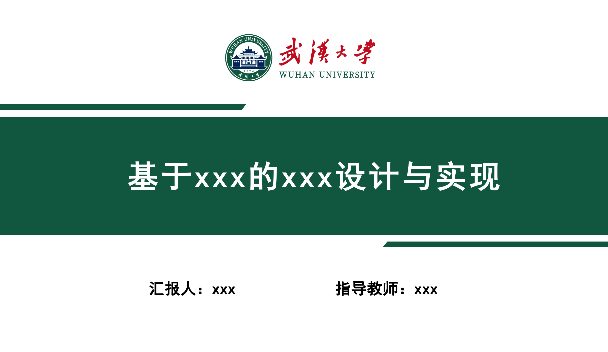
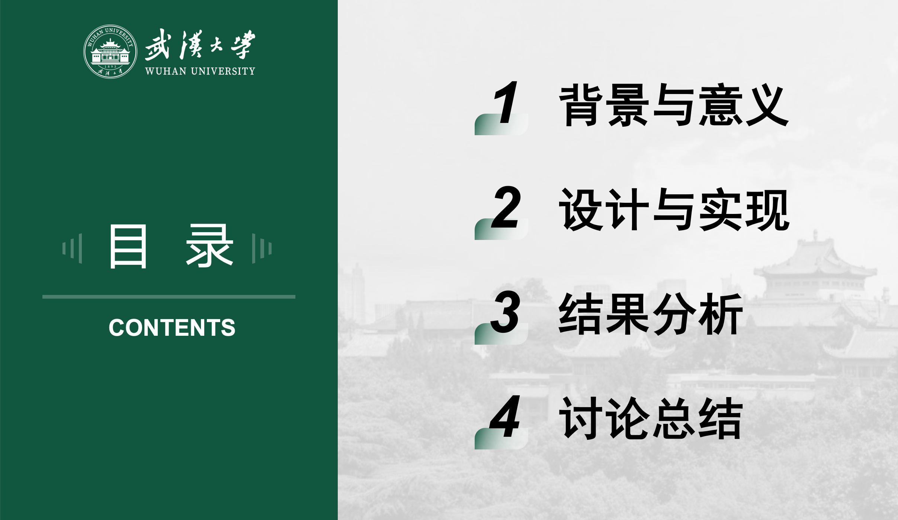
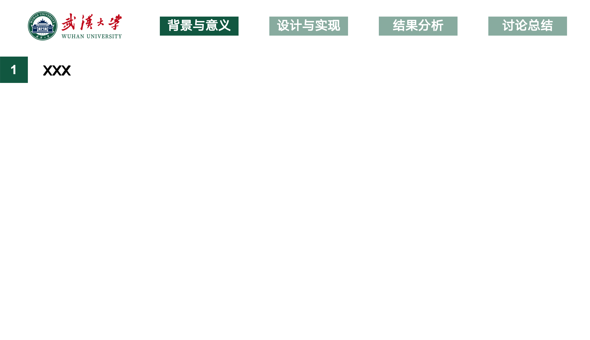
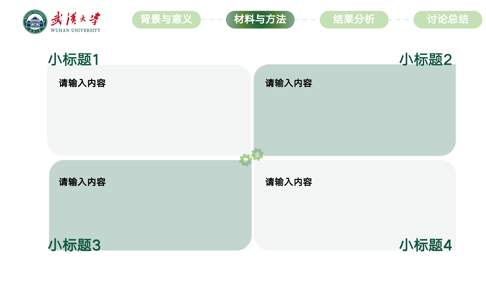
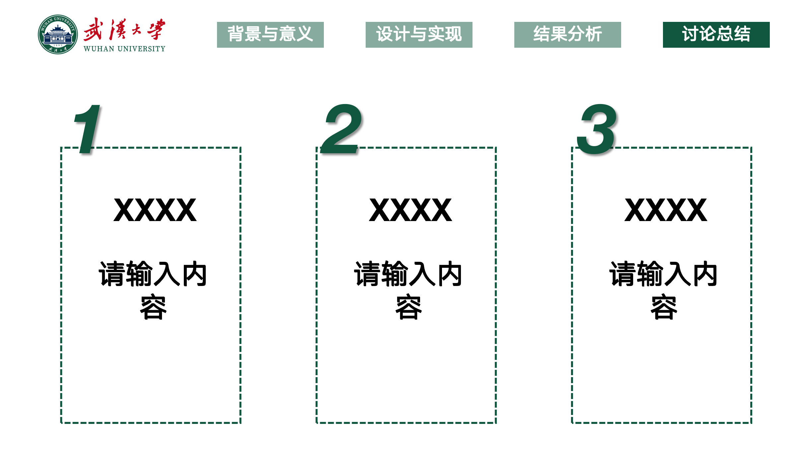
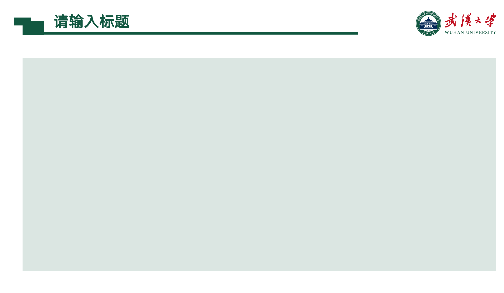
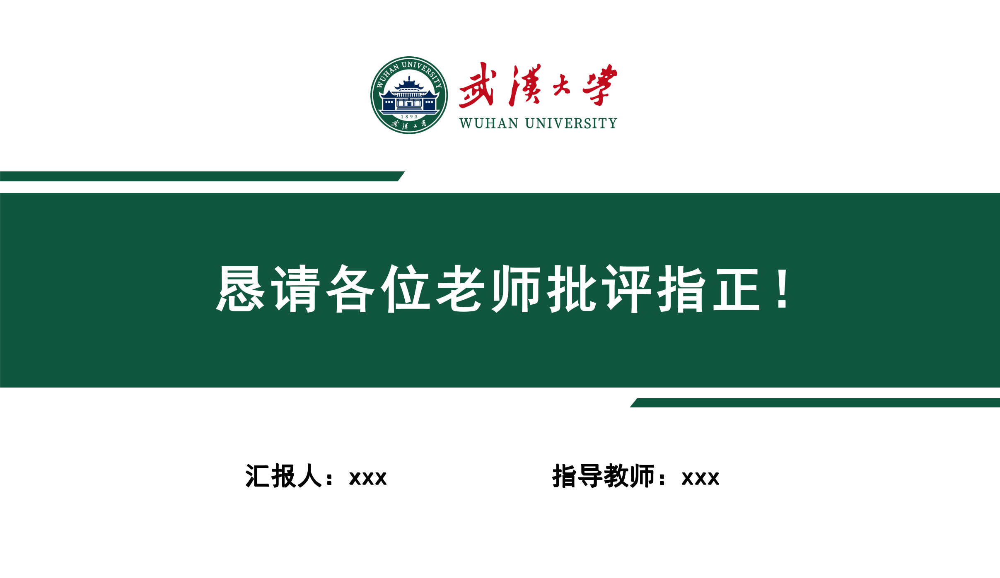

# Whu_Thesis
武大本科毕设相关，含论文模版、答辩ppt模版等

## 论文模版
latex模版：<https://github.com/whutug/whu-thesis>

word模版：`~/武汉大学本科生毕业论文（设计）参考模板（2024315）.doc`

论文要求：<https://uc.whu.edu.cn/xs/bylw_sj_.htm>

## 论文skills
<https://github.com/HughYau/AcademicForge>

## PPT模版
模版1：`～/whu_thesis.pptx`，改编自浙大cc98模版

模版2：<https://gitcode.com/open-source-toolkit/0a141/overview>

